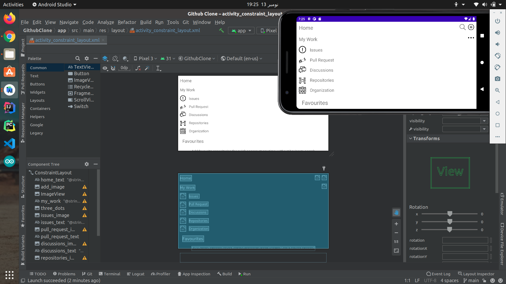
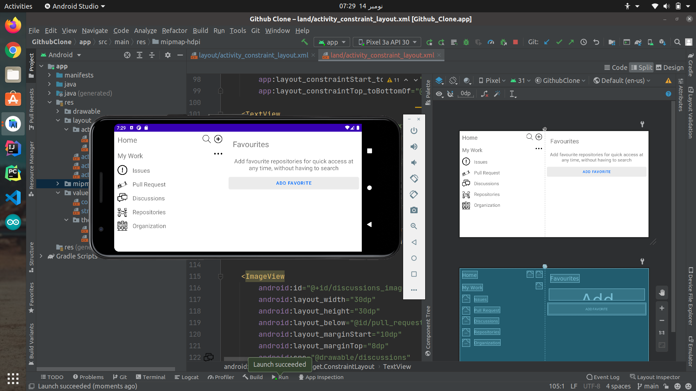
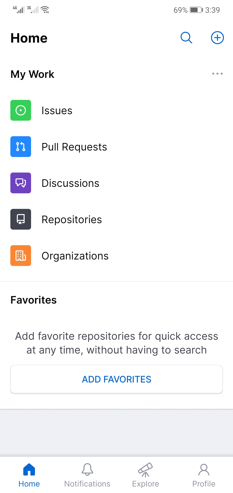
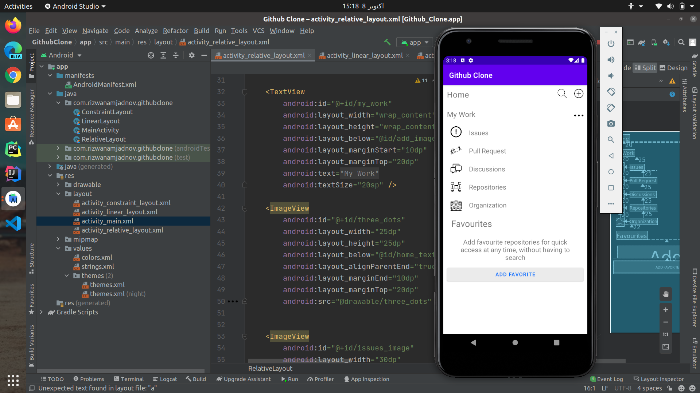
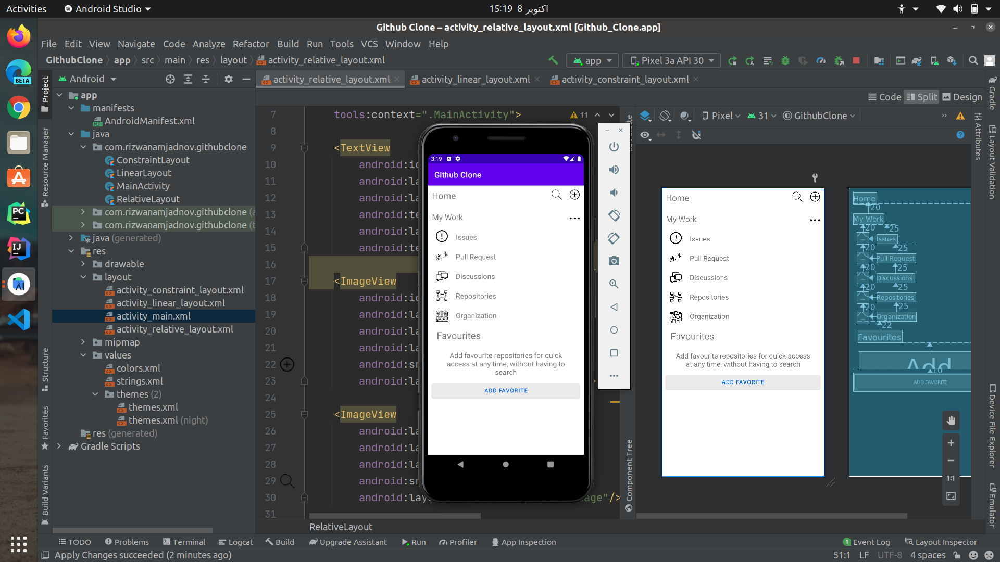
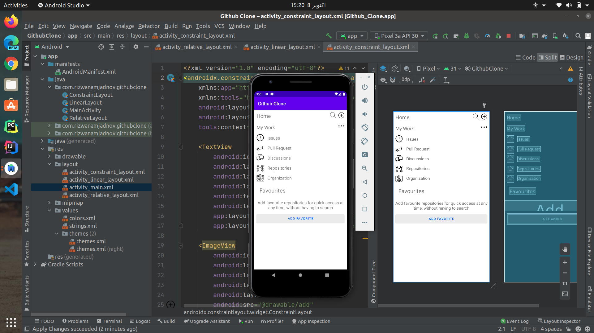

# Rizwan Amjad
This repository has 3 different activities with Linear, Relative and Constraint layout. That copies the Github App layout

Problem In Constraint Layout | Previous Version

Problem Solved Layout made Responsive

